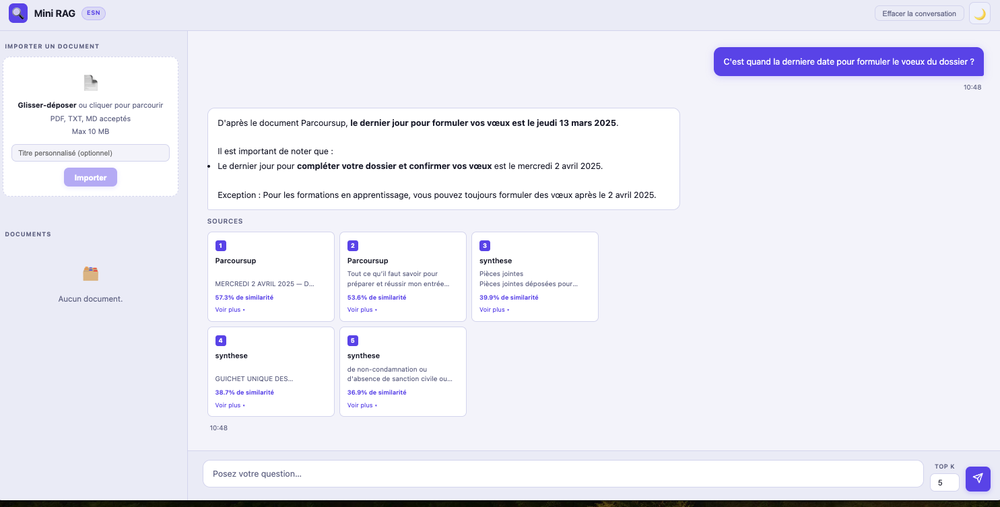

# Mini RAG ESN

Système RAG (Retrieval-Augmented Generation) permettant d'interroger une base de documents en langage naturel. On dépose des fichiers PDF/TXT/MD, on pose une question, le système retrouve les passages pertinents par recherche vectorielle et génère une réponse ancrée sur ces extraits via Claude.

---


---

## Problème résolu

Les LLM répondent à partir de leur mémoire d'entraînement. Ce projet leur donne accès à **vos propres documents** : contrats, notes internes, documentation technique. La réponse est toujours justifiée par des extraits sources avec score de similarité.

## Stack technique

| Couche | Technologie |
|--------|-------------|
| API | FastAPI + Uvicorn |
| Embeddings | OpenAI `text-embedding-3-small` (vecteurs 1536d) |
| Stockage vectoriel | Supabase (PostgreSQL + pgvector, index IVFFlat) |
| Génération | Claude via Anthropic API |
| Tokenisation | tiktoken `cl100k_base` |
| Frontend | Vanilla JS (SPA, sans framework) |

## Comment ça fonctionne

```
INDEXATION
Document (PDF/TXT/MD)
  → découpage en chunks de 500 tokens (overlap 50)
  → embedding OpenAI par batch
  → stockage dans Supabase (table chunks, colonne VECTOR(1536))

INTERROGATION
Question utilisateur
  → embedding de la question
  → recherche par similarité cosinus (opérateur <=> de pgvector)
  → top-K chunks récupérés
  → envoi à Claude avec les chunks comme contexte
  → réponse en français, ancrée sur les sources
```

Le retriever tente d'abord une connexion directe psycopg2 (plus rapide, opérateur natif pgvector), puis bascule sur l'API Supabase si `DATABASE_URL` n'est pas défini.


*Exemple de requête avec sources et scores de similarité*

## Installation

**Prérequis :** Python 3.11+, un projet Supabase, des clés API Anthropic et OpenAI.

```bash
# 1. Cloner
git clone <url-du-repo> && cd "Mini RAG-ESN"

# 2. Installer les dépendances
pip install -r requirements.txt

# 3. Configurer l'environnement
cp .env.example .env
# Remplir SUPABASE_URL, SUPABASE_KEY, ANTHROPIC_API_KEY, OPENAI_API_KEY dans .env

# 4. Initialiser la base de données
# Coller le contenu de sql/schema.sql dans l'éditeur SQL Supabase et exécuter

# 5. Lancer
uvicorn main:app --reload
```

Interface disponible sur [http://localhost:8000](http://localhost:8000).

## API

| Méthode | Endpoint | Description |
|---------|----------|-------------|
| `POST` | `/upload` | Ingère et indexe un document (PDF, TXT, MD) |
| `POST` | `/ask` | Pose une question, retourne la réponse + sources |
| `GET` | `/documents` | Liste les documents indexés |
| `DELETE` | `/documents/{id}` | Supprime un document et ses chunks |

## Structure du projet

```
app/
├── routes/      # Handlers FastAPI (pas de logique métier)
├── services/    # chunker · embedder · retriever · generator
├── db/          # Client Supabase singleton
└── models/      # Schémas Pydantic
sql/schema.sql   # Tables, index IVFFlat, fonction match_chunks
frontend/        # SPA vanilla JS (dark/light, historique, sources)
```

## Variables d'environnement

| Variable | Obligatoire | Défaut | Description |
|----------|-------------|--------|-------------|
| `SUPABASE_URL` | Oui | — | URL du projet Supabase |
| `SUPABASE_KEY` | Oui | — | Clé service role Supabase |
| `ANTHROPIC_API_KEY` | Oui | — | Clé API Claude |
| `OPENAI_API_KEY` | Oui | — | Clé API OpenAI |
| `DATABASE_URL` | Non | — | Connexion psycopg2 directe (plus rapide) |
| `EMBEDDING_MODEL` | Non | `text-embedding-3-small` | Modèle d'embedding OpenAI |
| `CLAUDE_MODEL` | Non | `claude-sonnet-4-6` | Modèle Claude |
| `CHUNK_SIZE` | Non | `500` | Taille des chunks en tokens |
| `CHUNK_OVERLAP` | Non | `50` | Recouvrement entre chunks |

## Roadmap

- [ ] Support Word (`.docx`) et Excel (`.xlsx`)
- [ ] OCR pour les PDFs scannés
- [ ] Authentification utilisateur
- [ ] Déploiement sur Railway / Render
